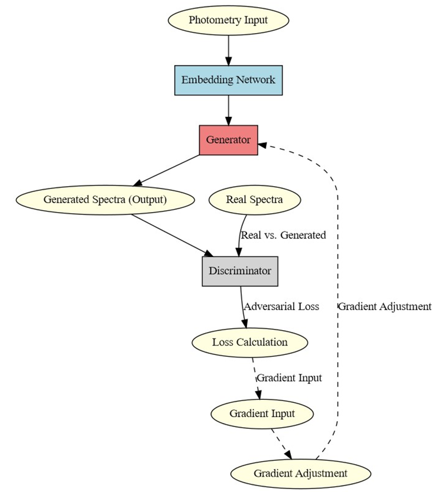
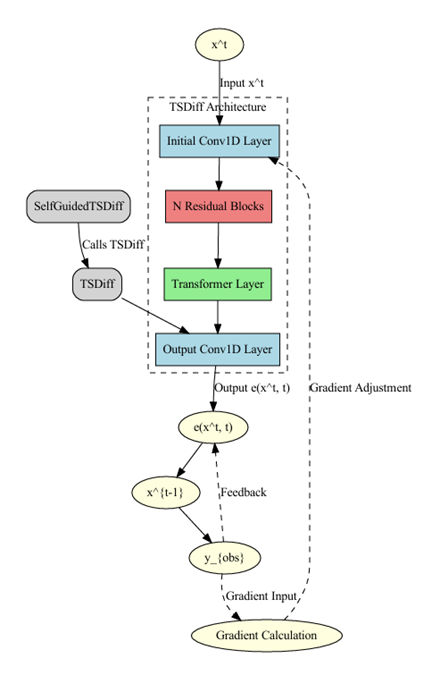

# AstroInformatics
## Purpose of the Project
The purpose of this project is to use various Deep Neural Networks to predict galaxy formation in high redshifts

## Data Generation
This project generates the photometry and spectometry of a Galaxy using AGN models, the Starburst and the Spheroid. 
These models create the spectometry and using different filters in various redshifts, the photometry is created.

# Generative Adversarial Networks (GANs) 
This model uses the method of [Time-series Generative Adversarial Networks](https://papers.nips.cc/paper_files/paper/2019/hash/c9efe5f26cd17ba6216bbe2a7d26d490-Abstract.html).
The structure of the model is:

# Diffusion Model
This models uses the method of []

